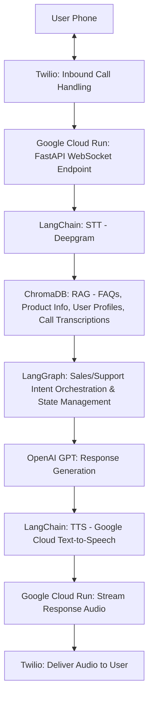

## deploy chromaDB on GCP

to deploy chromaDB on GCP, i used the steps used on the following repo. https://github.com/HerveMignot/chromadb-on-gcp/tree/main

here is the summary

### create bucket
gsutil mb -p fusion-ai-wil02 -l us-central1  gs://fusion-ai-wil02-bucket/

### set all the necessary variables
* export SERVICE_NAME=""
* export SERVICE_ACCOUNT=""
* export SERVICE_REGION=""
* export API_TOKEN="" --this is used for to authenticate with chromaDB
* export BUCKET_NAME=""
* export MIN_INSTANCES=1  # Set to 1 to keep the service always on
* export project_id=""

### create deploy.yml file and then
run `gcloud run services replace deploy.yaml --project fusion-ai-wil02`

### then allow authenticated access by:
run
 gcloud run services add-iam-policy-binding chroma    --member=allUsers --role=roles/run.invoker --region=us-central1 --project=<project-id>

### test access using python code and API token

import chromadb
from chromadb.config import Settings

### Create a Chroma client with the service URL and API token

client = chromadb.HttpClient(host="<YOUR_SERVICE_URL>", port=443, ssl=True,
        settings=Settings(chroma_client_auth_provider="chromadb.auth.token_authn.TokenAuthClientProvider",
        chroma_client_auth_credentials="xxyz",
        anonymized_telemetry=False))

## Deploy fastAPI using on GCP cloud

### Rebuild completely with no cache
docker build --platform=linux/amd64 --no-cache -t gcr.io/<project-id>/voice-ai-agent .

### Push the new image
docker push gcr.io/<project-id>/voice-ai-agent

### Redeploy

gcloud run deploy voice-ai-agent \
  --image gcr.io/fusion-ai-wil02/voice-ai-agent \
  --region us-central1 \
  --platform managed \
  --allow-unauthenticated \
  --set-secrets "OPENAI_API_KEY=openai-api-key:latest,TWILIO_ACCOUNT_SID=twilio-account-sid:latest,TWILIO_AUTH_TOKEN=twilio-auth-token:latest,DEEPGRAM_API_KEY=deepgram-api-key:latest,CHROMADB_API_TOKEN=chromadb-api-token:latest" \
  --set-env-vars "CHROMADB_COLLECTION_NAME=knowledge_base,BUCKET_NAME=fusion-xxx-bucket,SERVER_HOST=voice-ai-agent-xxx.us-central1.run.app,CHROMADB_SERVICE_NAME=chroma,CHROMADB_SSL=True" \
  --service-account voice-agent-sa@<project-id>.iam.gserviceaccount.com

### Test endpoint connecton

To test the `/voice` endpoint, run:
```bash
 curl -X POST https://voice-ai-agent-xxx.run.app/voice`


This should return the following XML:

<?xml version="1.0" encoding="UTF-8"?>
<Response>
  <Connect>
    <Stream url="wss://voice-ai-agent-xx.run.app/twilio-websocket" />
  </Connect>
</Response>
```

## Process Description

* Inbound Call Handling:

Twilio receives an inbound call and streams audio to a FastAPI WebSocket endpoint using Twilio Media Streams.

The FastAPI server, deployed on Google Cloud Run, processes the audio in real-time.

* Audio Processing:

Deepgram transcribes incoming audio to text with low latency (~100-200ms).

LangChain processes the transcription to extract intent (sales or support).

* Context Retrieval (RAG):

LangChain queries ChromaDB with the transcribed text to retrieve relevant FAQs, product info, user profiles, or past conversation transcripts.

Transcribed call conversations are stored in ChromaDB after each interaction for future context.

* Conversation Orchestration:

LangGraph identifies the intent (sales or support) and routes the query:

Sales: Fetch product details from ChromaDB, generate a promotional response.

Support: Retrieve user profile or conversation history, escalate if needed.

* Response Generation:

OpenAI GPT processes the transcribed query + RAG context to generate a response.

LangChain structures prompts to ensure intent-specific responses.

* Audio Synthesis:

Google Cloud Text-to-Speech converts the LLM response to audio (using Wavenet voice for natural tone).

Audio is streamed back to Twilio via FastAPI.

* Response Delivery:

Twilio plays the synthesized audio to the caller.

* Conversation Storage:

After the call, the transcription is stored in ChromaDB with metadata (e.g., call ID, intent) for future RAG queries.


## process diagram

